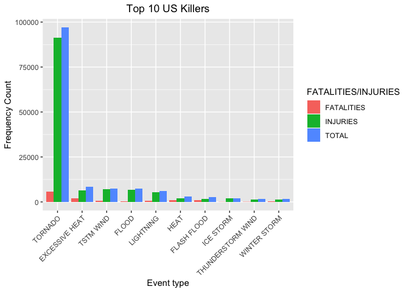
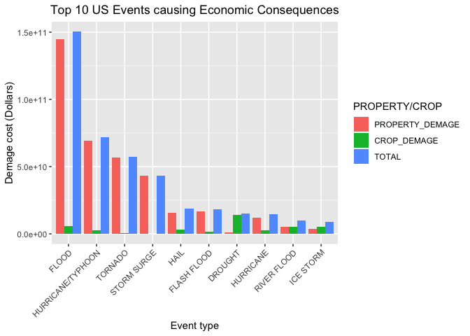

## Synopsis

This project involves exploring the U.S. National Oceanic and Atmospheric Administration's (NOAA) storm database. This database tracks characteristics of major storms and weather events in the United States, including when and where they occur, as well as estimates of any fatalities, injuries, and property damage.

The following analysis investigates which types of severe weather events from 1950 to 2011 are most harmful on:

1. Health (injuries and fatalities) 
2. Property and crops (economic consequences)

Dataset: [Storm Data] (https://d396qusza40orc.cloudfront.net/repdata%2Fdata%2FStormData.csv.bz2)

There is also some documentation of the database available. Here you will find how some of the variables are constructed/defined.

National Weather Service [Storm Data Documentation](https://d396qusza40orc.cloudfront.net/repdata%2Fpeer2_doc%2Fpd01016005curr.pdf)

National Climatic Data Center Storm Events [FAQ](https://d396qusza40orc.cloudfront.net/repdata%2Fpeer2_doc%2FNCDC%20Storm%20Events-FAQ%20Page.pdf)

## Data Processing

### - Load the data

```r
library("data.table")
library("ggplot2")
stormDT <- read.csv("StormData.csv")
stormDT <- as.data.table(stormDT)
names(stormDT)
```

```
##  [1] "STATE__"    "BGN_DATE"   "BGN_TIME"   "TIME_ZONE"  "COUNTY"    
##  [6] "COUNTYNAME" "STATE"      "EVTYPE"     "BGN_RANGE"  "BGN_AZI"   
## [11] "BGN_LOCATI" "END_DATE"   "END_TIME"   "COUNTY_END" "COUNTYENDN"
## [16] "END_RANGE"  "END_AZI"    "END_LOCATI" "LENGTH"     "WIDTH"     
## [21] "F"          "MAG"        "FATALITIES" "INJURIES"   "PROPDMG"   
## [26] "PROPDMGEXP" "CROPDMG"    "CROPDMGEXP" "WFO"        "STATEOFFIC"
## [31] "ZONENAMES"  "LATITUDE"   "LONGITUDE"  "LATITUDE_E" "LONGITUDE_"
## [36] "REMARKS"    "REFNUM"
```

```r
head(stormDT)
```

```
##    STATE__           BGN_DATE BGN_TIME TIME_ZONE COUNTY COUNTYNAME STATE
## 1:       1  4/18/1950 0:00:00     0130       CST     97     MOBILE    AL
## 2:       1  4/18/1950 0:00:00     0145       CST      3    BALDWIN    AL
## 3:       1  2/20/1951 0:00:00     1600       CST     57    FAYETTE    AL
## 4:       1   6/8/1951 0:00:00     0900       CST     89    MADISON    AL
## 5:       1 11/15/1951 0:00:00     1500       CST     43    CULLMAN    AL
## 6:       1 11/15/1951 0:00:00     2000       CST     77 LAUDERDALE    AL
##     EVTYPE BGN_RANGE BGN_AZI BGN_LOCATI END_DATE END_TIME COUNTY_END COUNTYENDN
## 1: TORNADO         0                                               0         NA
## 2: TORNADO         0                                               0         NA
## 3: TORNADO         0                                               0         NA
## 4: TORNADO         0                                               0         NA
## 5: TORNADO         0                                               0         NA
## 6: TORNADO         0                                               0         NA
##    END_RANGE END_AZI END_LOCATI LENGTH WIDTH F MAG FATALITIES INJURIES PROPDMG
## 1:         0                      14.0   100 3   0          0       15    25.0
## 2:         0                       2.0   150 2   0          0        0     2.5
## 3:         0                       0.1   123 2   0          0        2    25.0
## 4:         0                       0.0   100 2   0          0        2     2.5
## 5:         0                       0.0   150 2   0          0        2     2.5
## 6:         0                       1.5   177 2   0          0        6     2.5
##    PROPDMGEXP CROPDMG CROPDMGEXP WFO STATEOFFIC ZONENAMES LATITUDE LONGITUDE
## 1:          K       0                                         3040      8812
## 2:          K       0                                         3042      8755
## 3:          K       0                                         3340      8742
## 4:          K       0                                         3458      8626
## 5:          K       0                                         3412      8642
## 6:          K       0                                         3450      8748
##    LATITUDE_E LONGITUDE_ REMARKS REFNUM
## 1:       3051       8806              1
## 2:          0          0              2
## 3:          0          0              3
## 4:          0          0              4
## 5:          0          0              5
## 6:          0          0              6
```

### - Rebuild the data

```r
stormDT_sub <- stormDT[(EVTYPE != "?" & (INJURIES > 0 | FATALITIES > 0 | PROPDMG > 0 | CROPDMG > 0)), c("EVTYPE", "FATALITIES", "INJURIES", "PROPDMG", "PROPDMGEXP", "CROPDMG", "CROPDMGEXP") ]
head(stormDT_sub, 20)
```

```
##      EVTYPE FATALITIES INJURIES PROPDMG PROPDMGEXP CROPDMG CROPDMGEXP
##  1: TORNADO          0       15    25.0          K       0           
##  2: TORNADO          0        0     2.5          K       0           
##  3: TORNADO          0        2    25.0          K       0           
##  4: TORNADO          0        2     2.5          K       0           
##  5: TORNADO          0        2     2.5          K       0           
##  6: TORNADO          0        6     2.5          K       0           
##  7: TORNADO          0        1     2.5          K       0           
##  8: TORNADO          0        0     2.5          K       0           
##  9: TORNADO          1       14    25.0          K       0           
## 10: TORNADO          0        0    25.0          K       0           
## 11: TORNADO          0        3     2.5          M       0           
## 12: TORNADO          0        3     2.5          M       0           
## 13: TORNADO          1       26   250.0          K       0           
## 14: TORNADO          0       12     0.0          K       0           
## 15: TORNADO          0        6    25.0          K       0           
## 16: TORNADO          4       50    25.0          K       0           
## 17: TORNADO          0        2    25.0          K       0           
## 18: TORNADO          0        0    25.0          K       0           
## 19: TORNADO          0        0    25.0          K       0           
## 20: TORNADO          0        0    25.0          K       0
```

### - Convert exponent columns into actual exponents

```r
# Map property damage alphanumeric exponents to numeric values.
propDmgKey <-  c("\"\"" = 10^0,
                 "-" = 10^0, 
                 "+" = 10^0,
                 "0" = 10^0,
                 "1" = 10^1,
                 "2" = 10^2,
                 "3" = 10^3,
                 "4" = 10^4,
                 "5" = 10^5,
                 "6" = 10^6,
                 "7" = 10^7,
                 "8" = 10^8,
                 "9" = 10^9,
                 "H" = 10^2,
                 "K" = 10^3,
                 "M" = 10^6,
                 "B" = 10^9)

# Map crop damage alphanumeric exponents to numeric values
cropDmgKey <-  c("\"\"" = 10^0,
                "?" = 10^0, 
                "0" = 10^0,
                "K" = 10^3,
                "M" = 10^6,
                "B" = 10^9)
# Convert the exponent columns to actual exponents with mapping property key table
stormDT_sub$PROPDMGEXP <- as.numeric(lapply(as.character(stormDT_sub$PROPDMGEXP), function(i) propDmgKey[i]))
# Replace the NA value in exponent columns of property with 10^0
stormDT_sub[is.na(stormDT_sub$PROPDMGEXP),]$PROPDMGEXP <- rep(10^0, length(stormDT_sub[is.na(stormDT_sub$PROPDMGEXP),]$PROPDMGEXP))
# Convert the exponent columns to actual exponents with mapping crop key table
stormDT_sub$CROPDMGEXP <- as.numeric(lapply(as.character(stormDT_sub$CROPDMGEXP), function(i) cropDmgKey[i]))
# Replace the NA value in exponent columns of crop with 10^0
stormDT_sub[is.na(stormDT_sub$CROPDMGEXP),]$CROPDMGEXP <- rep(10^0, length(stormDT_sub[is.na(stormDT_sub$CROPDMGEXP),]$CROPDMGEXP))
head(stormDT_sub, 20)
```

```
##      EVTYPE FATALITIES INJURIES PROPDMG PROPDMGEXP CROPDMG CROPDMGEXP
##  1: TORNADO          0       15    25.0      1e+03       0          1
##  2: TORNADO          0        0     2.5      1e+03       0          1
##  3: TORNADO          0        2    25.0      1e+03       0          1
##  4: TORNADO          0        2     2.5      1e+03       0          1
##  5: TORNADO          0        2     2.5      1e+03       0          1
##  6: TORNADO          0        6     2.5      1e+03       0          1
##  7: TORNADO          0        1     2.5      1e+03       0          1
##  8: TORNADO          0        0     2.5      1e+03       0          1
##  9: TORNADO          1       14    25.0      1e+03       0          1
## 10: TORNADO          0        0    25.0      1e+03       0          1
## 11: TORNADO          0        3     2.5      1e+06       0          1
## 12: TORNADO          0        3     2.5      1e+06       0          1
## 13: TORNADO          1       26   250.0      1e+03       0          1
## 14: TORNADO          0       12     0.0      1e+03       0          1
## 15: TORNADO          0        6    25.0      1e+03       0          1
## 16: TORNADO          4       50    25.0      1e+03       0          1
## 17: TORNADO          0        2    25.0      1e+03       0          1
## 18: TORNADO          0        0    25.0      1e+03       0          1
## 19: TORNADO          0        0    25.0      1e+03       0          1
## 20: TORNADO          0        0    25.0      1e+03       0          1
```

### - Calculate total fatalities and injuries 

```r
storm_fatalities <- aggregate(stormDT_sub$FATALITIES, by = list(stormDT_sub$EVTYPE), FUN = sum)
colnames(storm_fatalities) <- c("EVENT", "FATALITIES")
storm_injuries <- aggregate(stormDT_sub$INJURIES, by = list(stormDT_sub$EVTYPE), FUN = sum)
colnames(storm_injuries) <- c("EVENT", "INJURIES")
storm_health <- merge(storm_fatalities, storm_injuries, by = "EVENT")
storm_health$TOTAL <- storm_health$FATALITIES + storm_health$INJURIES
# order by total fatalities and injuries
storm_health <- storm_health[order(-storm_health$TOTAL),][1:10,]
storm_health
```

```
##                 EVENT FATALITIES INJURIES TOTAL
## 406           TORNADO       5633    91346 96979
## 60     EXCESSIVE HEAT       1903     6525  8428
## 422         TSTM WIND        504     6957  7461
## 85              FLOOD        470     6789  7259
## 257         LIGHTNING        816     5230  6046
## 150              HEAT        937     2100  3037
## 72        FLASH FLOOD        978     1777  2755
## 237         ICE STORM         89     1975  2064
## 363 THUNDERSTORM WIND        133     1488  1621
## 480      WINTER STORM        206     1321  1527
```

### - Calculate total property and crop demanages

```r
storm_prop <- aggregate(stormDT_sub$PROPDMG*stormDT_sub$PROPDMGEXP, by = list(stormDT_sub$EVTYPE), FUN = sum)
colnames(storm_prop) <- c("EVENT", "PROPERTY_DEMAGE")
storm_crop <- aggregate(stormDT_sub$CROPDMG*stormDT_sub$CROPDMGEXP, by = list(stormDT_sub$EVTYPE), FUN = sum)
colnames(storm_crop) <- c("EVENT", "CROP_DEMAGE")
#head(storm_prop)
#head(storm_crop)
storm_economics <- merge(storm_prop, storm_crop, by = "EVENT")
storm_economics$TOTAL <- storm_economics$PROPERTY_DEMAGE + storm_economics$CROP_DEMAGE
# Order by total property and crop demanages
storm_economics <- storm_economics[order(-storm_economics$TOTAL),][1:10,]
storm_economics
```

```
##                 EVENT PROPERTY_DEMAGE CROP_DEMAGE        TOTAL
## 85              FLOOD    144657709807  5661968450 150319678257
## 223 HURRICANE/TYPHOON     69305840000  2607872800  71913712800
## 406           TORNADO     56935880688   414953270  57350833958
## 349       STORM SURGE     43323536000        5000  43323541000
## 133              HAIL     15730367518  3025537890  18755905408
## 72        FLASH FLOOD     16822673978  1421317100  18243991078
## 48            DROUGHT      1046106000 13972566000  15018672000
## 214         HURRICANE     11868319010  2741910000  14610229010
## 309       RIVER FLOOD      5118945500  5029459000  10148404500
## 237         ICE STORM      3944927860  5022113500   8967041360
```

## Result

### - Events that are the most harmful to population health

```r
storm_health_table <- melt(storm_health, id.vars = "EVENT", variable.name = "FATALITIES/INJURIES", value.name = "VALUE")
```

```
## Warning in melt(storm_health, id.vars = "EVENT", variable.name = "FATALITIES/
## INJURIES", : The melt generic in data.table has been passed a data.frame and
## will attempt to redirect to the relevant reshape2 method; please note that
## reshape2 is deprecated, and this redirection is now deprecated as well. To
## continue using melt methods from reshape2 while both libraries are attached,
## e.g. melt.list, you can prepend the namespace like reshape2::melt(storm_health).
## In the next version, this warning will become an error.
```

```r
#storm_health_table
health_chart <- ggplot(storm_health_table, aes(x = reorder(EVENT, -VALUE) , y = VALUE))
health_chart + geom_bar(stat = "identity", aes(fill = `FATALITIES/INJURIES`), position = "dodge") + theme(axis.text.x = element_text(angle=45, hjust=1)) + ggtitle("Top 10 US Killers") + theme(plot.title = element_text(hjust = 0.5)) + xlab("Event type") + ylab("Frequency Count")
```

<!-- -->

```r
storm_health[which.max(storm_health$TOTAL),]
```

```
##       EVENT FATALITIES INJURIES TOTAL
## 406 TORNADO       5633    91346 96979
```

### - Events that have the Greatest Economic Consequences

```r
storm_economics_table <- melt(storm_economics, id.vars = "EVENT", variable.name = "PROPERTY/CROP", value.name = "VALUE")
```

```
## Warning in melt(storm_economics, id.vars = "EVENT", variable.name = "PROPERTY/
## CROP", : The melt generic in data.table has been passed a data.frame and will
## attempt to redirect to the relevant reshape2 method; please note that reshape2
## is deprecated, and this redirection is now deprecated as well. To continue using
## melt methods from reshape2 while both libraries are attached, e.g. melt.list,
## you can prepend the namespace like reshape2::melt(storm_economics). In the next
## version, this warning will become an error.
```

```r
#storm_economics_table
health_chart <- ggplot(storm_economics_table, aes(x = reorder(EVENT, -VALUE) , y = VALUE))
health_chart + geom_bar(stat = "identity", aes(fill = `PROPERTY/CROP`), position = "dodge") + theme(axis.text.x = element_text(angle=45, hjust=1)) + ggtitle("Top 10 US Events causing Economic Consequences") + theme(plot.title = element_text(hjust = 0.5)) + xlab("Event type") + ylab("Demage cost (Dollars)")
```

<!-- -->

```r
storm_economics[which.max(storm_economics$TOTAL),]
```

```
##    EVENT PROPERTY_DEMAGE CROP_DEMAGE        TOTAL
## 85 FLOOD    144657709807  5661968450 150319678257
```

